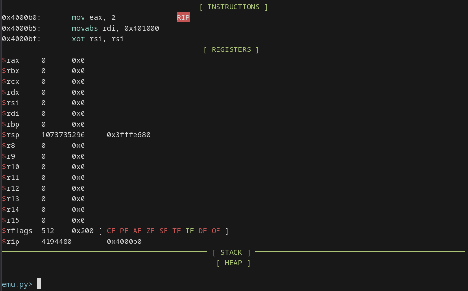

# x86 CPU emulator

## config.toml

The only thing you need to start emulation is a "config.toml" file. It's a config file with TOML syntax. Here is an example:
```
[config]
binary = "example_binary"
memory = "1GB"
tscticks = "3GHz"

[debug]
debugmode = true
timelessdebugging = true

[env]
envp = ["\u0001", "\u0000", "\u0000", "\u0000", "\u0000", "\u0000", "\u0000", "\u0000"]

[files]
files = """{"test.txt": "A file.", "dir": {"test.txt": "A file in a directory."}"""
```

"binary" field there sets the binary to emulate. Memory sets the memory size for the binary and tscticks field sets the TSC ticks of CPU.

"debugmode" field enables the debug mode which makes the program stop after every instruction and show registers, stack, etc. If "timelessdebugging" field is enabled, you can go backwards when program is running.

"envp" field is for specifying environmental variables. Also you can specify arguments there too.

You can create a virtual file system (VFS) using files field. To create a file, you add a key-value pair to dictionary where key is name of the file and value is content of the file. To create a directory, you need to create a key-value pair where key is the name of the directory and value is another dictionary where it contains other files and sub-directories.

## Debug screen
The debug screen consists of 4 parts.

1. Instructions

Instructions part is the place where you can see the instruction RIP pointing to and the next 2 instructions which will be executed.

2. Registers
 
Registers part is the place where you can see the value of registers. SIMD registers aren't shown by default, but you can see them by typing "toggle simd" in the input.

3. Stack

You can see stack variables here. You would probably think why can't see the things that are pushed. Because stack part shows the memory region from RBP to RSP. By default RBP is initialized 0, so it can't be shown.

4. Heap
 
Heap is the part where heap is shown. Heap is generally empty because simple programs don't typically use use the heap.



## Debug screen commands
1. si				Forwards one instruction
2. bi				Backwards one instruction (Works if time less debugging is enabled)
3. c				Continues until a breakpoint
4. bc				Continues backwards until a breakpoint
5. br				Sets a breakpoint
6. v				Shows a memory region
7. ci				Changes instruction
8. cr				Changes register
9. disasm			Shows instructions at an address.
10. toggle ...		Toggles something on the debug view
11. rf				Refreshes the debug view.
12. q				Exits emulation
13. help			Shows this help message.

Toggle commands:
1. simd				Toggles showing SIMD registers.
2. clearscreen		Toggles clearing screen.
3. stack			Toggles showing stack.
4. heap				Toggles showing heap.
5. registers		Toggles showing registers.

##  Total number of instructions and syscalls
Total instruction count: 145

SIMD instruction count: 24

Total 64-bit linux system call count: 13

Total 32-bit linux system call count: 6
